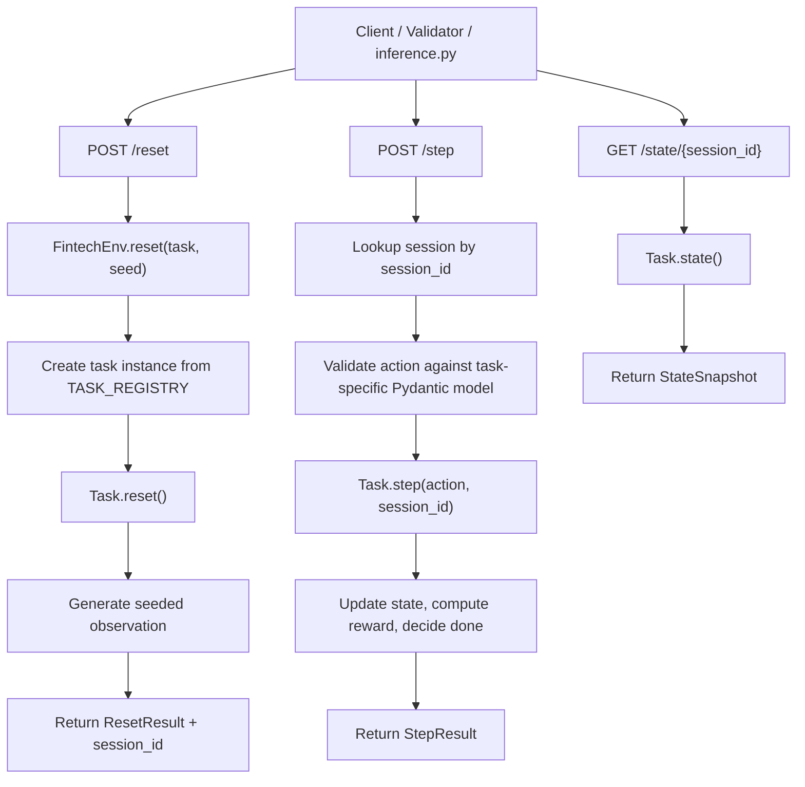
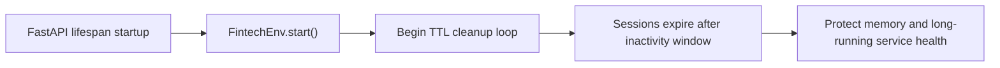
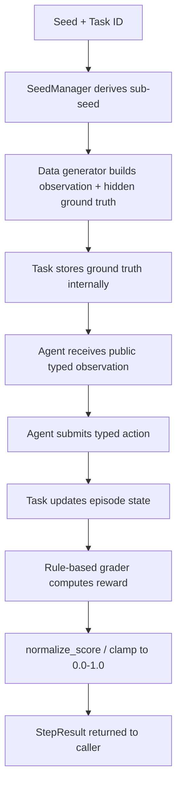
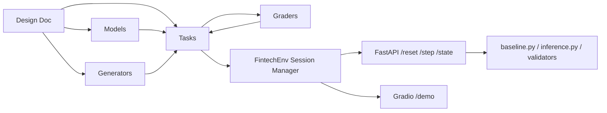

# OpenEnv Fintech Architecture And Requirement Audit

This document does three things:

1. audits the repo against the stated OpenEnv submission requirements
2. explains the file structure and responsibility split
3. maps the implementation back to the design in `openenv-fintech-design.md`

---

## 1. Executive Summary

`openenv-fintech` is a realistic financial operations benchmark with three seeded tasks:

- loan underwriting
- fraud detection
- portfolio rebalancing

The implementation is structured around:

- typed Pydantic observation, action, and result models
- deterministic generators and deterministic graders
- task-local `reset()` / `step()` / `state()` behavior
- a session-aware FastAPI layer for concurrent episodes
- OpenEnv packaging and validation artifacts

The repo is now validator-clean:

- `openenv validate` passes
- `pytest -q` passes

---

## 2. Requirement Audit

## Functional Requirements

| Requirement | Status | Why |
|---|---|---|
| Real-world task simulation | Satisfied | All three tasks model real financial work done by humans: underwriting, fraud review, and rebalancing. |
| OpenEnv spec compliance | Satisfied with session-wrapper note | Typed models exist, `openenv.yaml` exists, `openenv validate` passes, and tasks implement `reset()` / `step()` / `state()`. The top-level HTTP layer wraps these in session-aware endpoints for multi-user operation. |
| Minimum 3 tasks with agent graders | Satisfied | Three tasks exist with deterministic rule-based graders and easy/medium/hard progression. |
| Meaningful reward function | Satisfied | Rewards provide partial credit, final episode scoring, and negative pressure for bad behavior or violations. |
| Baseline inference script uses OpenAI client and env vars | Mostly satisfied | `inference.py` uses `AsyncOpenAI`, reads `OPENAI_API_KEY`, and can run all 3 tasks. Reproducibility is strongest in the deterministic heuristic baseline; model-based runs still depend on upstream provider consistency. |

## Non-Functional Requirements

| Requirement | Status | Why |
|---|---|---|
| Deploys to a Hugging Face Space | Repo-ready, not live-verified here | README frontmatter and Docker packaging are in place, but a live Space deployment still has to be created and smoke-tested. |
| Containerized execution | Repo-ready, not locally daemon-verified here | `Dockerfile` exists and is configured correctly, but local `docker build` was previously blocked by the machine’s Docker daemon not running. |
| Documentation | Satisfied | `README.md` now includes motivation, task definitions, setup/usage, action/observation descriptions, and baseline scores. `RUNNING.md` and this file provide deeper operational detail. |

## Senior Engineer Verdict

At the repo level, the environment is in good shape and is OpenEnv-validator compliant.

The remaining risk is not architectural. It is operational:

- live Hugging Face Space deployment
- Docker daemon availability on the target machine
- final remote smoke test after deployment

---

## 3. File Structure And Responsibility

```text
FinBench/
├── app.py                         # FastAPI API surface and optional /demo Gradio mount
├── baseline.py                    # deterministic heuristic benchmark runner
├── inference.py                   # OpenAI-client model runner across one or all tasks
├── openenv.yaml                   # OpenEnv metadata and task registry
├── pyproject.toml                 # OpenEnv/package metadata, scripts, dependencies
├── Dockerfile                     # container entrypoint for HF Space / local docker run
├── server/
│   ├── __init__.py
│   └── app.py                     # validator-compatible server entrypoint (main())
├── openenv_fintech/
│   ├── env.py                     # session manager and task registry
│   ├── scoring.py                 # clamp/normalize utilities
│   ├── data/
│   │   ├── generators.py          # seeded synthetic data generation
│   │   └── seeds.py               # deterministic sub-seed derivation
│   ├── models/
│   │   ├── observations.py        # typed observation models
│   │   ├── actions.py             # typed action models and validators
│   │   └── results.py             # ResetResult, StepResult, EpisodeResult, StateSnapshot
│   ├── graders/
│   │   ├── base.py                # grader abstraction
│   │   ├── rule_based.py          # deterministic task scoring logic
│   │   └── llm_judge.py           # optional Anthropic reasoning scorer
│   └── tasks/
│       ├── base.py                # task abstraction
│       ├── loan_underwriting.py   # easy task engine
│       ├── fraud_detection.py     # medium task engine
│       └── portfolio_rebalancing.py # hard task engine
├── tests/
│   ├── test_models.py             # schema validation
│   ├── test_reproducibility.py    # seeded determinism
│   ├── test_env.py                # task flow behavior
│   ├── test_graders.py            # score behavior and floors
│   ├── test_api.py                # HTTP API coverage
│   └── test_inference.py          # inference logging contract
├── RUNNING.md                     # run/test/deploy guide
└── PROJECT_ARCHITECTURE.md        # this file
```

## How The Pieces Work Together

- `openenv_fintech/models` defines the public contract.
- `openenv_fintech/data` generates seeded synthetic inputs and hidden ground truth.
- `openenv_fintech/tasks` owns episode progression and task-local state.
- `openenv_fintech/graders` converts agent behavior into deterministic scores.
- `openenv_fintech/env.py` creates isolated task sessions and handles cleanup.
- `app.py` exposes the environment over HTTP for validators, scripts, and the demo.
- `baseline.py` evaluates deterministic heuristics.
- `inference.py` evaluates a model through an OpenAI-compatible API.

---

## 4. Mapping The Design Doc To The Code

## Design Intent

The design doc in `openenv-fintech-design.md` defines:

- three finance tasks
- deterministic synthetic generation
- typed observation/action schemas
- partial-credit rewards
- Docker + HF deployment

## Implementation Mapping

| Design Area | Implemented In |
|---|---|
| Environment overview and task list | `openenv.yaml`, `openenv_fintech/env.py` |
| Observation and action schema | `openenv_fintech/models/observations.py`, `openenv_fintech/models/actions.py` |
| Seeded synthetic data | `openenv_fintech/data/seeds.py`, `openenv_fintech/data/generators.py` |
| Reward and graders | `openenv_fintech/graders/rule_based.py`, `openenv_fintech/scoring.py` |
| Sequential task logic | `openenv_fintech/tasks/*.py` |
| HTTP runtime | `app.py`, `server/app.py` |
| Benchmark runners | `baseline.py`, `inference.py` |

## Where The Implementation Intentionally Diverges

- The design doc is concept-first; the runtime is session-aware. That means the HTTP layer wraps task-local `reset()` and `step()` with `session_id` so multiple episodes can coexist safely.
- The optional LLM judge exists but is disabled by default for deterministic benchmark behavior.
- The validator-compatible `server/app.py` is a thin entry shim, not the main business-logic file.

---

## 5. OpenEnv Lifecycle: `start()`, `reset()`, `step()`, `state()`

## What Is The Canonical Episode Interface?

At the task level, the canonical environment interface is:

- `reset()` -> generate the first typed observation
- `step(action)` -> apply the typed action and return a typed `StepResult`
- `state()` -> return the serializable state snapshot

This interface lives in the task engines:

- `LoanUnderwritingTask`
- `FraudDetectionTask`
- `PortfolioRebalancingTask`

## What Does `FintechEnv.start()` Mean Here?

`FintechEnv.start()` is not the episode API. It is the service lifecycle hook.

Its only job is to start background session cleanup:

- launch a TTL cleanup loop
- expire stale sessions
- keep the HTTP server safe for long-running or crashed clients

That is correct for a multi-session deployment.

## Why `reset()` Is Wrapped By `create_session()`

The repo needs concurrent HTTP sessions, so the top-level environment manager adds session semantics:

- `FintechEnv.reset(task, seed)` starts a new task episode
- `FintechEnv.create_session(task, seed)` is the same operation with a more explicit name
- both return `ResetResult` plus `session_id`

This is the correct implementation choice for a server deployment. The single-episode semantics still exist inside each task.

## Lifecycle Diagram



## Service Lifecycle Diagram



---

## 6. Request And Scoring Flow

## Reset / Step / Grade Flow



## Component Interaction



---

## 7. Task-Level OpenEnv Semantics

## Loan Underwriting

- `reset()` creates one applicant and stores hidden default probability
- `step()` scores approve/reject/request-info decisions
- if the agent requests more information in the ambiguous band, a deterministic follow-up observation is returned

## Fraud Detection

- `reset()` creates a full transaction stream and hidden fraud labels
- `step()` records one action for the current transaction
- final scoring happens at episode end, using precision/recall/F1/calibration style metrics

## Portfolio Rebalancing

- `reset()` pre-generates a full correlated price path and constraints
- `step()` applies trades, enforces constraints, advances time, and awards per-step partial credit
- final scoring combines tracking quality, budget efficiency, Sharpe-like behavior, and penalties

---

## 8. Does The Current Design Define OpenEnv Properly?

## Short Answer

Yes, with one important architectural nuance:

- task classes implement the clean episode contract
- the HTTP service wraps that contract in session management

That is the right shape for a deployable benchmark.

## Why This Is Correct

- A single in-memory global environment would be wrong for real HTTP usage.
- Session IDs are required if multiple episodes can exist at once.
- The environment still preserves `reset()` / `step()` / `state()` semantics, just with explicit session routing at the service boundary.

## If You Want Even Stricter Spec Purity

The next refinement would be introducing a dedicated single-session `EpisodeEnv` wrapper object and making `FintechEnv` purely a factory/session registry. That is not required for correctness today, but it would make the abstraction boundary even cleaner.

---

## 9. Remaining External Verification

The codebase is structurally ready. What still must be proven outside the repo:

- deploy the Docker image to a real Hugging Face Space
- confirm the Space is tagged and reachable
- run live remote smoke tests
- run final end-to-end Docker build on a machine with a running Docker daemon

---

## 10. Recommended Next Actions

1. Create the Hugging Face Docker Space and add the `openenv` tag.
2. Set secrets:
   `OPENAI_API_KEY`, `OPENAI_BASE_URL`, `MODEL_NAME`, and any optional fallbacks.
3. Deploy and verify:
   `POST /reset`, `POST /step`, `GET /health`, and `/demo`.
4. Run:
   `python3 baseline.py --task all --episodes 25 --seed 42`
5. Run:
   `python3 inference.py --task all --episodes 1 --seed 42`
6. Capture live benchmark outputs and update the README baseline section if you want published numbers from the deployed stack rather than local samples.
